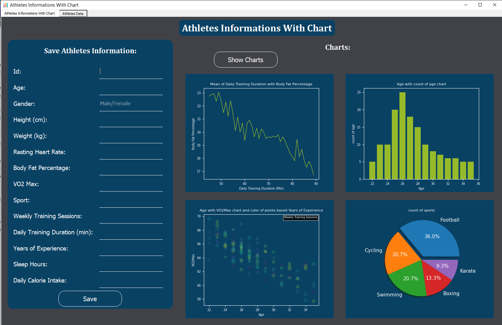
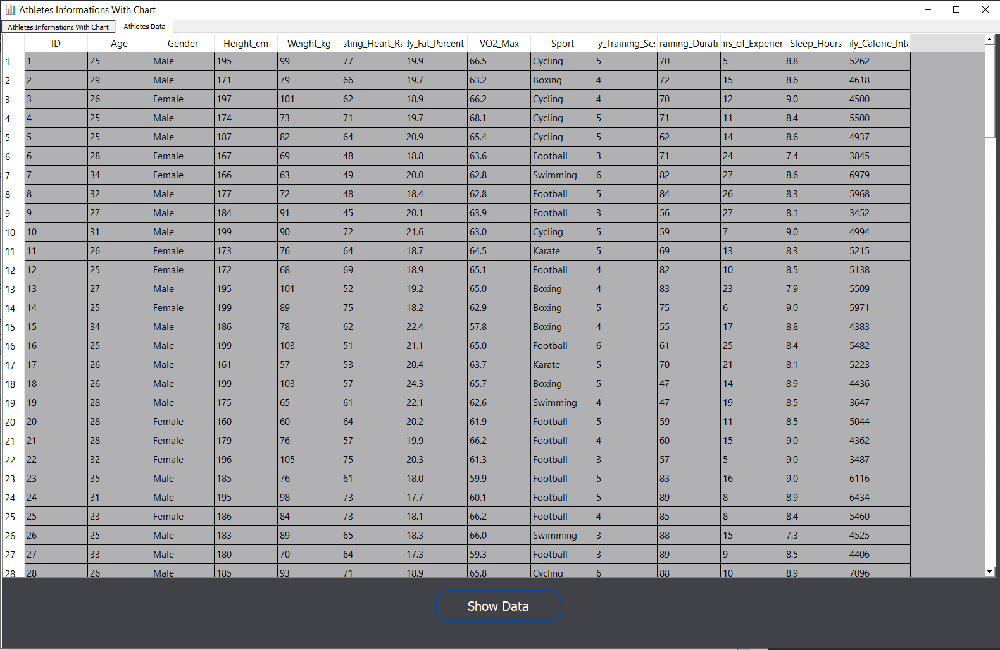

# 🏃‍♂️ Athletes Data Visualization

A desktop application developed using **Python** and **PyQt5** that allows users to visualize and add athlete data. It provides a user-friendly GUI to create dynamic plots and manage a dataset of athletes.

---

## 🚀 Features

- Visualize athlete data with interactive charts
- Add new athlete entries with a simple form
- Save updated data to CSV
- Clean and intuitive PyQt5 interface

---

## 🖼️ Screenshots

### 1. Tab one for save new data and show charts


### 2. Tab two for show all data in csv file


---

## 📦 Requirements

- Python 3.7+
- PyQt5
- pandas
- matplotlib

---

## 🛠 Installation

1. Clone the repository:

```bash
git clone https://github.com/Ghesmatireza8/Athletes-Data-Visualiztion.git
cd Athletes-Data-Visualiztion
```

2. (Optional) Create a virtual environment:

```bash
python -m venv venv
source venv/bin/activate        # Linux/macOS
venv\Scripts\activate         # Windows
```

3. Install dependencies:

```bash
pip install -r requirements.txt
```

If `requirements.txt` is missing, install manually:

```bash
pip install PyQt5 pandas matplotlib
```

4. Run the application:

```bash
python Athletes_Informations_With_Chart.py
```

---

## 📁 Project Structure

```
Athletes-Data-Visualiztion/
├── Athletes_Informations_With_Chart.py     # Main application
├── realistic_athletes_dataset.csv          # Sample athlete data
├── Data_Visualization.ui                   # UI design file
├── icon.png                                # Application icon
├── res.qrc                                 # Qt resource file
├── res.py                                  # Compiled Qt resource
├──screenshots                              # screenshots for show in README.md file
├── LICENSE                                 # License file for this project
└── README.md                               # Project description
```

---

## 📄 License

This project is licensed under the [MIT License](LICENSE).

---

## 🙋‍♂️ Author

Created by [@Ghesmatireza8](https://github.com/Ghesmatireza8)  
Feel free to contribute or reach out with feedback!
